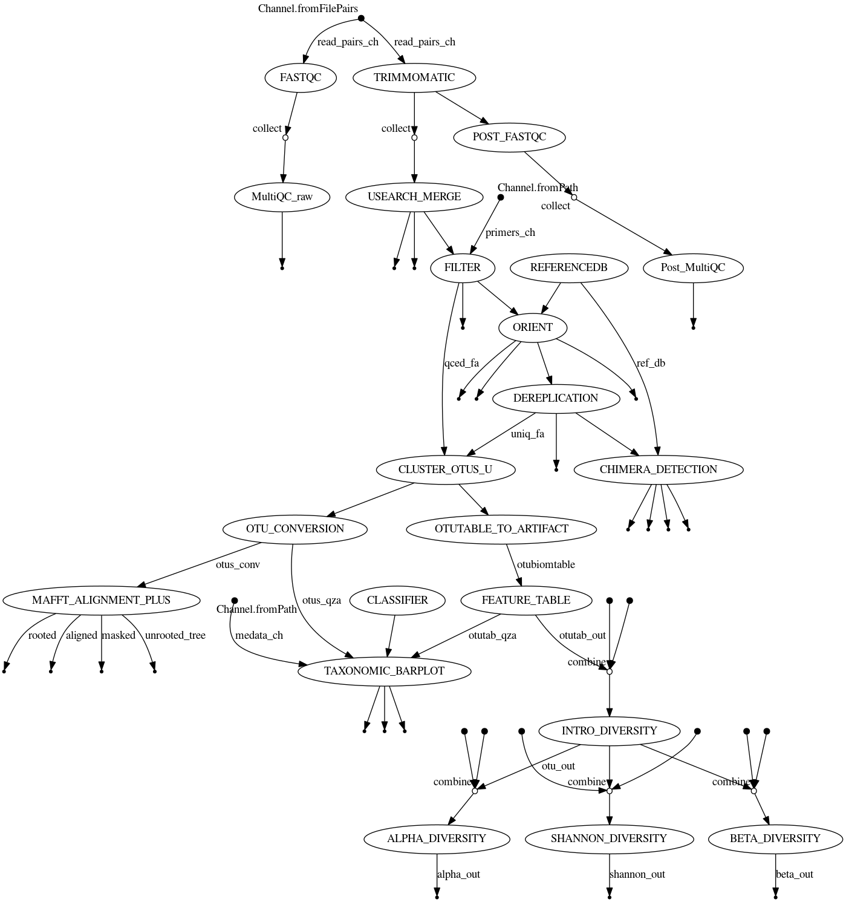
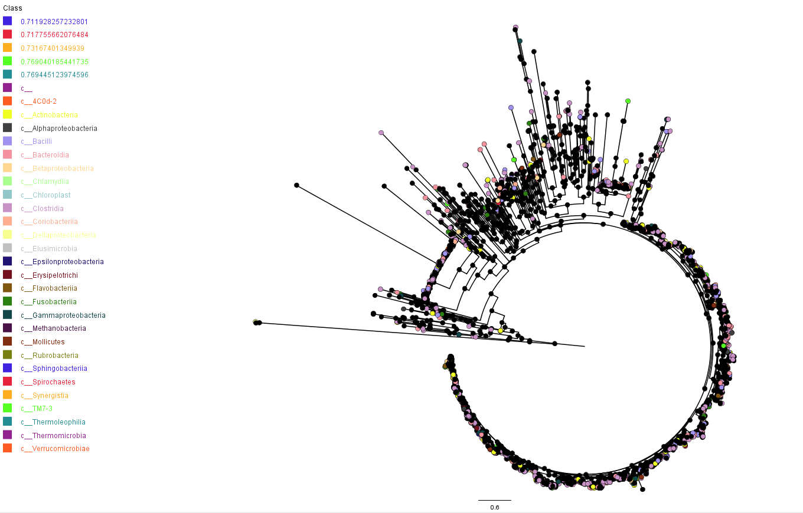
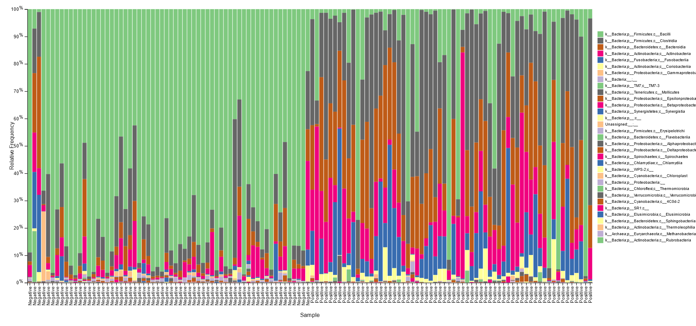
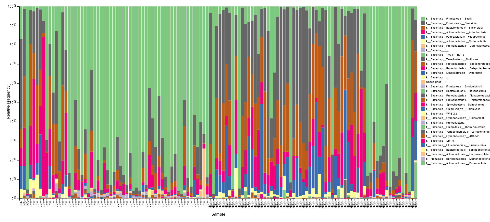

# Nexflow Report

We developed a Qiime2 16s nextflow workflow pipeline utilizing the following tools:
| *Tool* | *Version* |
|:----:| :------ |
| fastqc | v0.11.9 |
| multiqc | v1.4 |
| trimommatic | v0.39 |
| usearch | v11.0 |
| vsearch | v2.16 |
| qiime2 env | 2020.8 |
| nextflow | 20.10.0 (dsl 2) |

Our analysis pipeline follows the following order:
1. Quality check of raw reads
2. Trimming of adapters from reads
3. Merging/Stitching
4. Filtering and Primer removal
5. Orientation
6. Dereplication
7. Chimera detection
8. Clustering OTUs
9. Phylogeny
10. Taxonomy
11. Alpha diversity and Beta diversity

This workflow has been summarized in the Nextflow analysis figure below



## Sample info
We had a total of 124 paired end reads samples. These samples had a length of 250bp.

## Runtime analysis
The total runtime of each process is summarized in this Nextflow [report](./pipeline_info/execution_timeline.html).
The timeline report shows the job wall time and memory used by each individual sample in the different steps. It also provides info on the total
time used to run the entire workflow.

A summary of this information is available in form if average time for each step, the percentage of CPUs used and memory in
this [report](./pipeline_info/execution_report.html).

The average storage used by the different steps is summarized below;

|Analysis Step | time |Storage |
| -------- | -------- | -------- |
| Quality Check (fastqc & multiqc) |      | 388M & 4.5M |
| Trimming | | 21G |
| Quality Check (fastqc & multiqc) |      | 388M & 4.5M |
| Merging (usearch) | | 14G |
| Filtering (vsearch) | | 4.6G |
| Orient (vsearch) | | 4.9G |
| Dereplication (vsearch) |  | 197M |
| Chimera detection (vsearch) | | 261M |
| Cluster OTUs (usearch) | | 792K |
| Reference DB | | 7.2M |
| Artifacts and classifier | | 28M |
| Visualization (qiime2) | | 6.1M |

## Quality check
The Quality of the read was checked using fastqc. The data was characterized by low per base sequence content,
high sequence duplication and overrepresntation.

A summary for all the samples is can be seen in this [muiltiqc report](./figures/raw_multiqc_report.html)

## Trimming
Trimming was done using trimmomatic to remove sequencing adapters and low quality reads. The following parameters
were used to improve the read quality:
	- phred score 33
	- min length 36
	- sliding window 4:15

## Post trimming quality check
A summary of the results post trimming is available in this [multiqc report](./figures/post_multiqc_report.html)

## Merging
Using usearch merge we were able to stitch 91.76%. Unsticthed read were discarded.

```
Totals:
  20578230  Pairs (20.6M)
  18883320  Merged (18.9M, 91.76%)
  11799125  Alignments with zero diffs (57.34%)
    339274  Too many diffs (> 10) (1.65%)
     67847  Fwd too short (< 64) after tail trimming (0.33%)
    621679  Rev too short (< 64) after tail trimming (3.02%)
    666110  No alignment found (3.24%)
         0  Alignment too short (< 16) (0.00%)
         0  Merged too short (< 16)
         0  Merged too long (> 486)
     66970  Staggered pairs (0.33%) merged & trimmed
    184.49  Mean alignment length
    300.18  Mean merged length
      0.40  Mean fwd expected errors
      0.61  Mean rev expected errors
      0.22  Mean merged expected errors
```

## Filtering
vsearch was used with the following parameters

```
vsearch -fastq_filter all_reads_merged.fastq \
	--fastq_maxee 1.0 \
	--fastq_stripleft 24 \
	--fastq_stripright 25 \
	--fastq_qmax 75 \
	--fastaout filtered.fasta \
	--log filter.log
```
The `fastq_stripleft` and `fastq_stripright` are the lengths used to trim forward and reverse primers respectively. The `fastq_qmax`
is the maximum quality score to use.

18128002 sequences kept (of which 18128002 truncated), 755318 sequences discarded.

## Orientation

```
7438266 nt in 5181 seqs, min 1205, max 1585, avg 1436

Forward oriented sequences: 17753437 (97.93%)
Reverse oriented sequences: 53738 (0.30%)
All oriented sequences:     17807175 (98.23%)
Not oriented sequences:     320827 (1.77%)
Total number of sequences:  18128002
```

## Dereplication

```
4491530932 nt in 17805181 seqs, min 32, max 436, avg 252
minseqlength 32: 1994 sequences discarded.

758165 unique sequences, avg cluster 23.5, median 1, max 2501007
```

## Chimera detection
```
7438266 nt in 5181 seqs, min 1205, max 1585, avg 1436

    0.28  minh
    8.00  xn
    1.40  dn
    1.00  xa
    0.80  mindiv
    0.55  id
       2  maxp

uniqs.fasta: 114201/758165 chimeras (15.1%)
```

## Cluster ASVs
We used the `usearch unoise3` algorithm to do clustering which has the following conditions

1. ASVs which are more than 97% identical are clustered together
2. Sequences with less than 8 counts are discarded. [Bokulich et al.](www.nature.com/nmeth/journal/v10/n1/full/nmeth.2276.html)
	suggest using a 0.005% minimum abundance threshold, which in our case came out to be ~9, that is what we specified.
3. Sequences are ranked based on abundance, singletons are discarded
4. Chimeric reads are discarded

With these conditions the number of ASVs generated is lower compared to Dada2 pipeline. The advantage of `unoise3`
it doesn't produce spurious ASVs which can be an issue in Dada2. It also shows the best balance between resolution and specificity.
Comparisons of pipelines can be seen [here](https://journals.plos.org/plosone/article?id=10.1371/journal.pone.0227434) and
[here](https://etd.library.emory.edu/concern/etds/xp68kh03w?locale=zh).

1760 Unique Sequences were detected using `unoise3`. The counts table contains 1493 ASVs entries and counts for each sample.
```
# Cluster Totals from Unoise3
1760 good, 4228 chimeras

# Counts table
376414 nt in 1760 seqs, min 32, max 407, avg 214
Masking 100%
Counting k-mers 100%
Creating k-mer index 100%
Searching 100%
Matching unique query sequences: 16998774 of 18128002 (93.77%)
```

## Phylogeny
Alighnemt was done using `mafft` followed by masking non informative sites. The phylogenetic tree was constructed using `fasttree`. The rooted ASVs tree can be visualized below.



## Taxonomy
The Silva genes database was used for classification of  the ASVs. The classification presented below is up to level 3.

BV negative samples were mostly characterized by _Lactobacillales_ species with relative abundance >50% for most samples as shown below.



Low inflammation status was majorly characterized with _Lactobacillales_ in most samples as seen below.



## Alpha and Beta Diversity
### Bray Curtis Principal Coordinate Analysis (PcoA)
The outcome of a PCoA tells us that objects ordinated closer to one another are more similar than those ordinated further away.
Samples positive for BV cluster together while those negative for BV also cluster separately.


In the diagram below, samples with high inflammation, cluster together, those with low inflammation cluster together as well while those that are neutral cluster together separately.


The samples also cluster based on the Body Mass Index (BMI) as shown below:


### Evenness group significance
Evenness refers to how well the taxa are distributed within samples, that is, their abundances.
The figure below shows us the abundance of samples based on different parameters:

#### Samples positive for BV and those negative for BV.


#### Samples with high inflammation and low inflammation


#### Sample abundance based on BMI


#### Sample abundance based on age


### Shannon group significance


